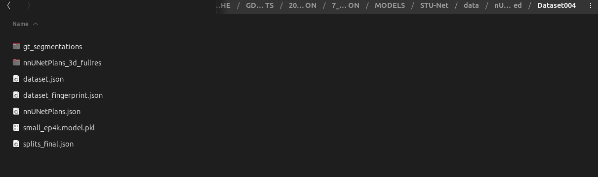

# STU-Net nnU‑Net v2 Fine‑Tuning

Step by step guide to fine-tune STU‑Net on your dataset using nnU‑Net v2.

---

# PRELIMINARY INSTLLATIONS

## 1. Clone the STU‑Net Repository

```bash
git clone https://github.com/uni-medical/STU-Net.git
cd STU-Net/nnUNet-2.2
```

---

## 2. Create & Activate Conda Environment

```bash
conda create -n stunet python=3.10 -y
conda activate stunet
```

---

## 3. Install Dependencies

```bash
pip install -r requirements.txt
#or with conda 
conda install -c conda-forge --file requirements.txt
```

---

## 4. Install nnU‑Net v2 & STU‑Net Trainers

Install the package in editable mode so that both the `nnunetv2` CLI and your custom STU‑Net trainers become available:

```bash
cd nnUNet-2.2
pip install -e .
```

---

# TRAINING/FINETUNING STARTS HERE

## 5. Set Environment Variables

Add the following lines to your `~/.bashrc` (or equivalent):

> **Note : it is best to create experiment specific folders for the nnUNet preprocessed and results folders.**


```bash

export nnUNet_raw="/path/to/nnUNet_raw"
export nnUNet_preprocessed="/path/to/nnUNet_preprocessed"
export nnUNet_results="/path/to/nnUNet_results"
```

Then reload:

```bash
source ~/.bashrc
```

---

## 6. Prepare Your Dataset

1. Ensure raw data lives under:

   ```
   $nnUNet_raw/Dataset004/
   ├─ imagesTr/
   ├─ labelsTr/
   └─ dataset.json
   ```

2. Create experiment specific nnuet preprocess and results folders


## 7. Plan & Preprocess (nnU‑Net v2)

Generate configurations and preprocessed data for the `3d_fullres` setup:

```bash
nnUNetv2_plan_and_preprocess -d 004 -c 3d_fullres --verify_dataset_integrity
```
 !!! The command above was not working for me - rather directly call the entrypoint:

```bash
python -m nnunetv2.experiment_planning.plan_and_preprocess_entrypoints \
  -d 004 -c 3d_fullres --verify_dataset_integrity
```


## 8. Copy the pkl file in the right preprocess folder - use the file that matches the model. 
Copy the appropriate `.pkl` under `plan_files/` directory and paste it under  the`nnUNet_preprocessed/Dataset004/` folder  or link it:

```bash
cp plan_files/Dataset004_nnUNetPlansv2.1_plans_3d_fullres.pkl \
   "$nnUNet_preprocessed/Dataset004/nnUNetPlansv2.1_plans_3d_fullres.pkl"
```

It should look like this after running the plan and process command above:





## 9. Download Pretrained Weights
- See the main `README.md` for download links.
- I put them under a new folder called `weights` in the `STU-Net` folder. The files look like `small_ep4k.model`.


## 10. Fine‑Tune STU‑Net


> Do not forget to put to off sleep/suspend/hibernate mode on your computer.

If you want to change hyperparameters of the trainer you can do so in  `nnUNet-2.2/nnunetv2/training/nnUNetTrainer/STUNetTrainer.py`.  
Also see this issue regarding learning rate : https://github.com/uni-medical/STU-Net/issues/24

Run fine‑tuning using the pretrained checkpoint and the STU‑Net trainer (use the trainer that matches your model size):

```bash
# Example with FOLD 1 
python nnunetv2/run/run_finetuning_stunet.py \
  004 3d_fullres 1 \
  -pretrained_weights "/path/to/small_ep4k.model" \ 
  -tr STUNetTrainer_small_ft
```

---

## 11. Troubleshooting Tips

* **KeyError: pool\_op\_kernel\_sizes**

  * Ensure your v2 plans file (`.pkl`) is in `$nnUNet_preprocessed/Dataset004/`.

* **ModuleNotFoundError: nnunetv2**

  * Confirm you ran `pip install -e .` in the active conda env and that `which nnUNetv2_plan_and_preprocess` points to that env.


## 12. Restarting training after interruption - seems to not work with the `run_finetuning_stunet.py` script --> start training from scratch again.